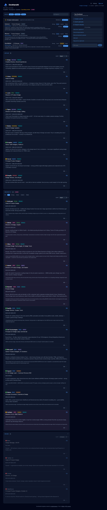
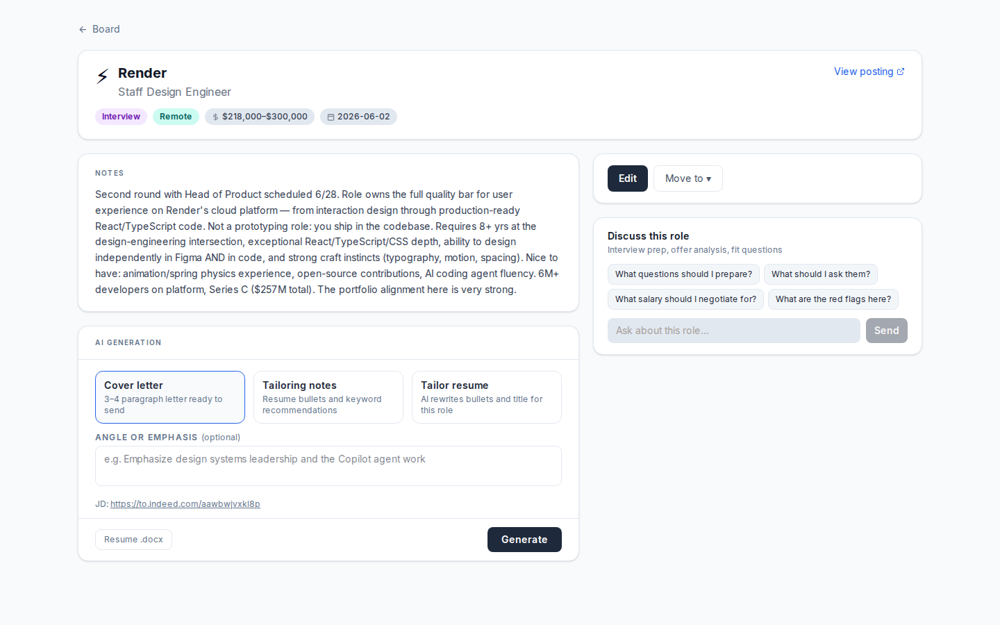
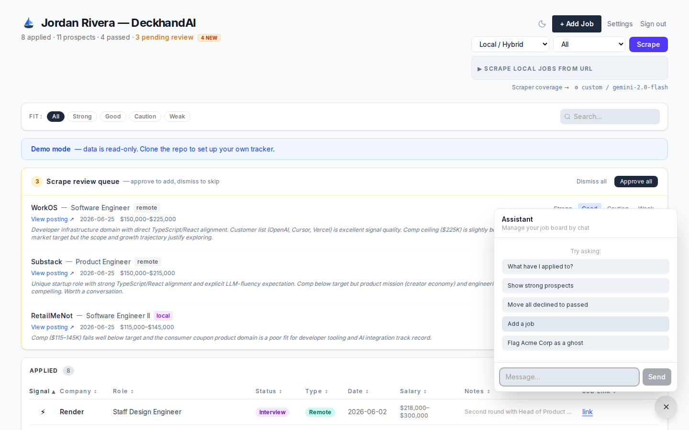
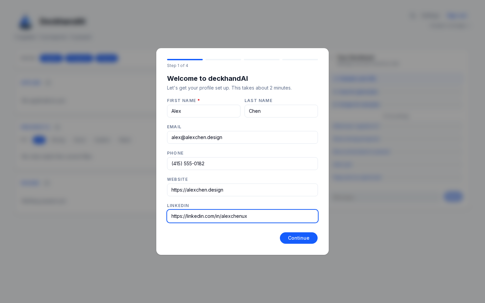

# deckhandAI

A self-hosted job search command center. Track prospects, scrape target company career pages, and generate ATS-safe resumes and cover letters with any AI model — no vendor lock-in, no database, no monthly fee.

**[→ Product overview](https://creativereason.com/deckhandai/)** — features, screenshots, and context on why it exists.

**[→ View live demo](https://deckhand-ai.vercel.app)** — read-only, sample data, no login required.

---

## What it does

- **Personal job tracker** — manage everything from first look to final decision; track prospects you're watching, applications in flight, and roles you've passed on, all in one private board
- **Automated scraping** — Playwright-based scraper hits target career pages on a schedule via GitHub Actions
- **AI throughout** — chat assistant, job fit scoring, ATS-safe resume tailoring, and cover letter generation; bring your own model (Anthropic, OpenAI, Ollama, or any OpenAI-compatible endpoint)
- **Zero infrastructure** — data lives in flat JSON files in your own private GitHub repo; deploy the UI to Vercel for free

---

## Screenshots

| Board | Job detail |
|---|---|
|  |  |

| AI chat assistant | Onboarding wizard |
|---|---|
|  |  |

---

## Quick start

```bash
# 1. Clone and install
git clone https://github.com/creativereason/deckhandAI.git
cd deckhandAI
yarn install

# 2. Run the setup wizard
node scripts/setup.mjs
# Prompts for GitHub token, data repo, app password, candidate profile,
# and AI provider — then writes .env.local, data/config.json, and data/profile.json

# 3. Run locally
yarn dev   # http://localhost:3000
```

**Want sample data to start from?** Run the data repo init script:

```bash
node scripts/init-sample-repo.mjs
# Creates a GitHub repo pre-populated with a realistic fictional candidate profile,
# job tracker data, work history, and scrape targets.
```

**Prefer to configure manually?** Copy the sample files and edit them directly:

```bash
cp data/config.sample.json data/config.json
cp data/profile.sample.json data/profile.json
cp data/jobs.sample.json data/jobs.json
```

---

## Deploy to Vercel

[](https://vercel.com/new/clone?repository-url=https%3A%2F%2Fgithub.com%2Fcreativereason%2FdeckhandAI&env=GITHUB_TOKEN,GITHUB_DATA_REPO,APP_PASSWORD,COOKIE_SECRET&envDescription=Required%20environment%20variables%20for%20deckhandAI&envLink=https%3A%2F%2Fgithub.com%2Fcreativereason%2FdeckhandAI%23environment-variables)

Set these environment variables in your Vercel project settings:

| Variable | Required | Description |
|---|---|---|
| `GITHUB_TOKEN` | Yes | Personal access token with `repo` scope |
| `GITHUB_DATA_REPO` | Yes | `username/repo-name` of your private data repo |
| `GITHUB_DATA_BRANCH` | No | Branch to read/write (default: `main`) |
| `APP_PASSWORD` | Yes | Password to protect the tracker UI |
| `COOKIE_SECRET` | Yes | Random 32+ character string for signing session cookies |
| `AI_API_KEY` | No | API key for Anthropic, OpenAI, etc. |
| `AI_PROVIDER` | No | `anthropic` \| `openai` \| `ollama` \| `custom` (default: `anthropic`) |
| `AI_BASE_URL` | No | Ollama or custom endpoint base URL |
| `DEMO_MODE` | No | `true` to enable read-only demo mode, bypasses auth |

The setup wizard generates these values for you locally. For Vercel, copy the values from your `.env.local` into your project's environment variable settings.

---

## Sample data repo

The quickest way to get a data repo with realistic starter data:

```bash
node scripts/init-sample-repo.mjs
```

This creates a new GitHub repo under your account and uploads pre-filled `jobs.json`, `config.json`, `profile.json`, and `scrape-targets.json` based on a fictional candidate (Alex Chen, Director of Product Design in Austin, TX). Use it as a starting point — swap in your own details in Settings after first login.

The same sample files power the [live demo](https://deckhand-ai.vercel.app).

**To host your own demo deployment:**

1. Run `init-sample-repo.mjs` with a public repo
2. Deploy deckhandAI to Vercel with:
   ```
   GITHUB_DATA_REPO=yourhandle/deckhandai-sample-data
   DEMO_MODE=true
   ```
   No `APP_PASSWORD` needed — demo mode bypasses auth and makes all writes read-only.

---

## Configuration

`data/config.json` controls your candidate profile, job filter preferences, and AI settings. The setup wizard writes this file for you, or copy from `data/config.sample.json` and edit manually.

Key fields:

- `candidate` — name, email, phone, website, LinkedIn
- `preferences.titles` — target job titles used for scrape filtering
- `preferences.salary` — minimum FTE base and contract hourly rate
- `preferences.locations` — remote/hybrid flags, hub city, hybrid radius in miles
- `ai` — provider, model, and optional base URL

---

## Profile (for AI generation)

`data/profile.json` is your structured work history — the source material the AI uses to write cover letters and resume tailoring notes. The setup wizard creates an initial version; edit it directly to add your experience bullets, strengths, and writing style rules.

See `data/profile.sample.json` for the full schema.

---

## Scraping

Add and manage scrape targets in two ways:

- **Settings UI** — go to Settings → Scrape Sources to add, edit, or remove targets without touching any files. Changes are saved to `data/scrape-targets.json` in your data repo.
- **Script** — edit `scripts/scrape-careers.mjs` directly for bulk setup or to define custom selectors. The script reads from `data/scrape-targets.json` at runtime if it exists, falling back to the targets defined in the file.

Run the scraper manually or let GitHub Actions run it on a schedule:

```bash
node scripts/scrape-careers.mjs
```

Requires Playwright with Chromium:

```bash
npx playwright install chromium
```

> **Vercel deployments cannot run the scraper.** Vercel's serverless environment does not support Chromium. To use automated scraping, run the scraper from your own machine or a self-hosted server — either on a schedule via cron or via the GitHub Actions workflow (`.github/workflows/scrape.yml`), which runs the script in a standard Ubuntu runner that supports Playwright.

---

## AI features

deckhandAI uses AI throughout the workflow — not just for document output. All features run through the same provider you configure, so one API key covers everything.

**Chat assistant**
A floating chat panel available on every page. Ask questions about your pipeline, get prioritization suggestions, or have it add, move, or update jobs through natural language.

**Job fit evaluation**
Each job in your tracker can be scored against your target titles, salary floor, and location preferences. The AI explains why a role is a strong fit or a caution, surfacing signal you'd otherwise have to read manually.

**Cover letter generation**
Drafts a tailored cover letter from your work history (`profile.json`) and the job description. Streamed in real time, editable inline, and exportable as a styled DOCX or print-to-PDF.

**ATS-safe resume tailoring**
Takes your base resume and rewrites the summary and experience bullets to match the specific role — single-column layout, no tables or text boxes, bullets via proper list markup so they survive every ATS parser. Outputs a ready-to-submit DOCX.

**Provider options**
deckhandAI supports several AI providers. Choose whichever fits your setup.

### Option 1 — Anthropic (Claude)

Requires an Anthropic Console account at [console.anthropic.com](https://console.anthropic.com). This is **separate from a Claude.ai subscription** — the API is pay-as-you-go with credits you add to your account. A standard Claude.ai plan does not include API access.

Cost in practice: generating a cover letter with `claude-sonnet-4-6` costs a few cents per call. $5–10 in credits goes a long way for personal use.

```json
{
  "ai": {
    "provider": "anthropic",
    "model": "claude-sonnet-4-6",
    "base_url": null
  }
}
```

```
AI_API_KEY=sk-ant-...
```

### Option 2 — OpenAI

Requires an OpenAI account at [platform.openai.com](https://platform.openai.com) with credits loaded. Same pay-as-you-go model.

```json
{
  "ai": {
    "provider": "openai",
    "model": "gpt-4o",
    "base_url": null
  }
}
```

```
AI_API_KEY=sk-...
```

### Option 3 — Ollama (local, free)

If you have [Ollama](https://ollama.com) running on your machine or local network, you can use it with no API key and no per-call cost. Good models for this use case: `llama3`, `mistral`, `phi3`.

```bash
ollama pull llama3   # one-time download
ollama serve         # runs at http://localhost:11434
```

```json
{
  "ai": {
    "provider": "ollama",
    "model": "llama3",
    "base_url": "http://localhost:11434/v1"
  }
}
```

No `AI_API_KEY` needed.

### Option 4 — Gemini (Google, has a free tier)

Google Gemini has a free tier with generous rate limits — a good starting point if you don't want to add a credit card. Get an API key at [aistudio.google.com](https://aistudio.google.com) (free, just needs a Google account).

```json
{
  "ai": {
    "provider": "custom",
    "model": "gemini-2.0-flash",
    "base_url": "https://generativelanguage.googleapis.com/openai/v1"
  }
}
```

```
AI_API_KEY=your-google-ai-studio-key
```

`gemini-2.0-flash` is fast and capable for document generation. `gemini-1.5-pro` is stronger if quality matters more than speed.

### Option 5 — Grok (xAI)

Grok is OpenAI-compatible and tends to have competitive pricing. Get an API key at [console.x.ai](https://console.x.ai).

```json
{
  "ai": {
    "provider": "custom",
    "model": "grok-3",
    "base_url": "https://api.x.ai/v1"
  }
}
```

```
AI_API_KEY=your-xai-key
```

### Option 6 — Other OpenAI-compatible endpoints

Any OpenAI-compatible API works the same way — LM Studio, vLLM, or any other local server. Set `provider` to `custom`, point `base_url` at your server, and set the model name to whatever your server expects.

```json
{
  "ai": {
    "provider": "custom",
    "model": "your-model-name",
    "base_url": "http://your-server:port/v1"
  }
}
```

---

Set your provider via the setup wizard (`node scripts/setup.mjs`) or edit `data/config.json` directly. The API key goes in `.env.local` as `AI_API_KEY`.

---

## Data privacy

`jobs.json`, `config.json`, and `profile.json` are gitignored by default. Your job search data, salary notes, application history, and work history never leave your own deployment. AI generation happens server-to-model — your data is not sent to any third party beyond the AI provider you configure.

---

## What's next

See [ROADMAP.md](ROADMAP.md) for planned features including an AI chat assistant, ghost job detection, and more.

---

## Contributing

See [CONTRIBUTING.md](CONTRIBUTING.md).

---

## License

MIT
